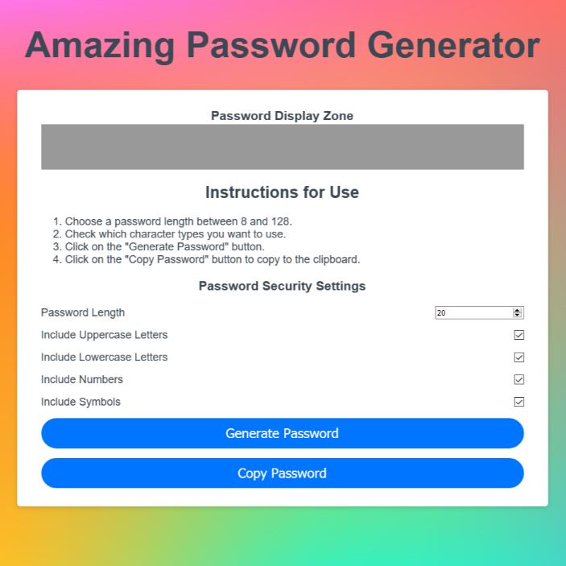

## Password Generator

## Description 

This website is a Password Generator. It allows the user to choose from these options: lowercase letters, uppercase letters, numbers, and special characters. The user also needs to specify the length of the password that is generated (8 - 128 characters). 

[Link to published website](https://jdavidrice.github.io/Password_Generator_2/)

## Table of Contents

* [Description](#Description)
* [Table of Contents](#Table-of-Contents)
* [Photo](#Photo)
* [Installation](#Installation)
* [Usage](#Usage)
* [Credits](#Credits)
* [License](#License)
* [Badges](#Badges)
* [Contributing](#Contributing)
* [Tests](#Tests)

## Photo

* [Return to Top](#Password-Generator)

## Installation

There is nothing to install to utilize this Password Generator. 

* [Return to Top](#Password-Generator)

## Usage 

This Password Generator can be used to generate passwords. 

* [Return to Top](#Password-Generator)

## Credits

JavaScript file based on video from Traversy Media. [JavaScript Password Generator](https://www.youtube.com/watch?v=duNmhKgtcsI)

* [Return to Top](#Password-Generator)

## License

No licenses used or implied 

* [Return to Top](#Password-Generator)

## Badges

No badges 

* [Return to Top](#Password-Generator)

## Contributing

Jeremy Rice

* [Return to Top](#Password-Generator)

## Tests

No tests

* [Return to Top](#Password-Generator)

